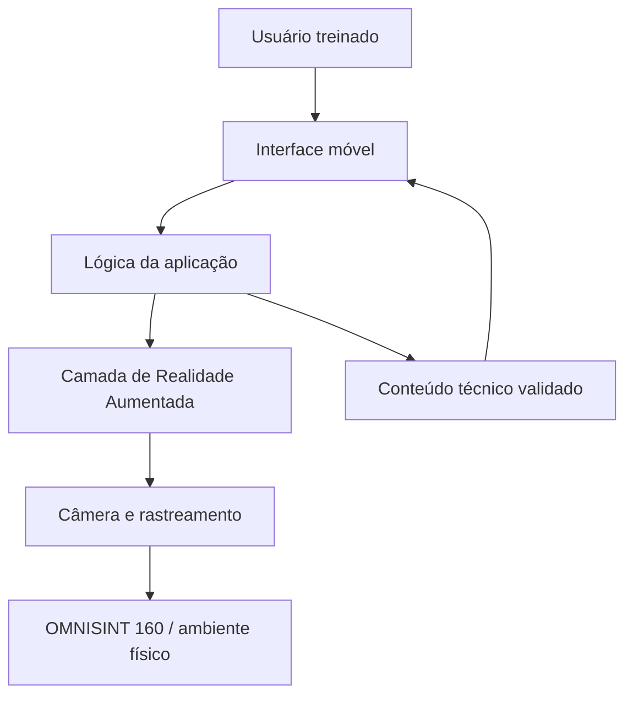

# Arquitetura conceitual

A arquitetura será refinada após a configuração do projeto Unity e definição da técnica de rastreamento.

## Componentes

### Usuário
Aluno ou usuário autorizado que já recebeu treinamento presencial.

### Interface móvel
Responsável por iniciar a experiência, apresentar informações e permitir navegação.

### Lógica da aplicação
Gerencia estados da consulta, conteúdo associado e sequência operacional delimitada.

### Camada de Realidade Aumentada
Fará a ligação entre a referência física/visual e o conteúdo digital.

### Câmera e rastreamento
Capturam o ambiente e identificam a referência definida para o protótipo.

### Conteúdo técnico validado
Informações derivadas da documentação oficial da OMNISINT 160 e validadas antes do experimento.

## Decisões ainda pendentes

- versão do Unity;
- versão do AR Foundation;
- plugin XR/plataforma-alvo;
- técnica definitiva de rastreamento;
- smartphone(s) de teste.

Esses itens só serão preenchidos após configuração e teste reais.
